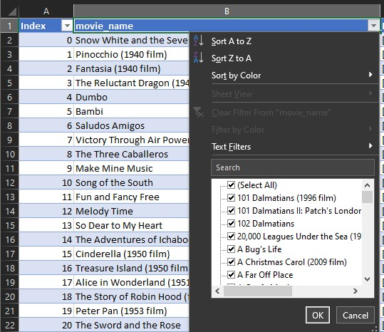

# Clean and Explore Data

## Create Table

  

## Remove Duplicates

### Method 1: Duplicates Feature
1. Select Data or Highlight Entire Data Set
2. Data > Data Tools > Remove Duplicates

  

### Method 2: Advanced Filter
Data > sort & Filter > Advanced

  

### Method 3: =UNIQUE(table)
N/A (only availble in Office365

### Method 4: Power Query
N/A (Current excel does not have feature available)

## Removing Empty/Blank Cells
1. Ctrl G > Specials or Ctrl G > Alt S or F5 > Go to Specials or Alt S

Skipped Step as it will change my table

Overlapping sections

  

## Removing Incorrect Data

### Filters
Data > Filters

  

### Conditional Formatting

#### =IF(ISERROR)

  
  

#### Other

=IF(ISNUMBER)
=IF(ISTEXT)
=IF(ISBLANK())

### Data Validation

  

## Remove [ ] Beginning and End of Cells with Characters
Visual Basic for Applications (VBA)

Macro - Alt F11
Developer > Visual Basic

  

  

  

